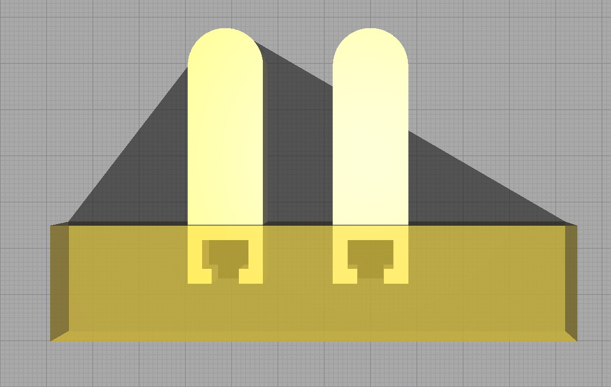

# Compliant Finray-Effect Gripper for High-Speed Robotic Assembly of Electrical Components

## Content  
The following directories contain the CAD files of the compliant finray-effect grippers. 

### Finray_FEA_models

Here a variety of finalized finray fingers can be found with varying infill direction and density, as .ipt or .stp files. This was mainly used for an FEA to compare experimental data, an alternative, fast approach was used to design the compliant finray grippers, which is described in "Slicing Process of Finray Models". Completely modeling the gruippers in CAD is not seen as an efficient way. 

### Finray_designs

Finray_designs contains the final iterations of the grippers used in the presented video, provided either as .ipt, .stp or .stl for your preferred slicer software. Finray_9 is the final iteration used for the experiments, however, Finray_8 provides a basis for own designs of the notch. Different versions of Finray_8_notch were used to test an additional contact surface. 

### Magazine

Here, the magazine used to achieve a constant known pose of the plug to be gripped can be found, as .ipt, .stp or .stl. The fixture is used as a contact plane for the plug, the spring is used to slightly press the plug against the fixture. The design was chosen to achieve generalisability to hold various plugs. 

### Mount

Here, the mount to connect the fingers with the gripper module can be found, as .ipt, .stp or .stl. Please note, that these were designed to fit the gripper module "IEG 76-030" from Weiss Robotics. 

## Slicing Process of Finray Models

The slicing software used was Ultimaker Cura. Here the parameters for the gripper can be set. The infill type is set to lines in Cura, to achieve the desired rib-structure, the option to connect infill lines is turned off. To allow compliance of the skin of the finger, the wall line count has to be set to one, with a line width close to the nozzle diameter (0.4 mm in my case). The line width of the infill is also set to 0.4 mm. The top and bottom layers are removed to fully achieve compliance through the ribs. In the first tests, infill densities of 10%, 20% and 30% were used, with the direction of the infill lines varying in 10 degree steps from 0° to 40°.

For the lower connecting section of the finger different slicing settings have to be used where Cura's "support blocker" feature is applied.
The support blocker allows dividing the two sections of the finger to change selected slicing parameters. For example, other than for the section of the fingers with the ribs, top and bottom layers are needed here. With the option "Per Model Settings" the wall/top/bottom thickness, wall line count and top/bottom layers can be changed individually for the section within the support blocker. This allows the part to be manufactured with individual settings.

If you're interested in working with the fingers with an additional contact plane keep in mind to add an additionall "support blocker" feature to the notches.

